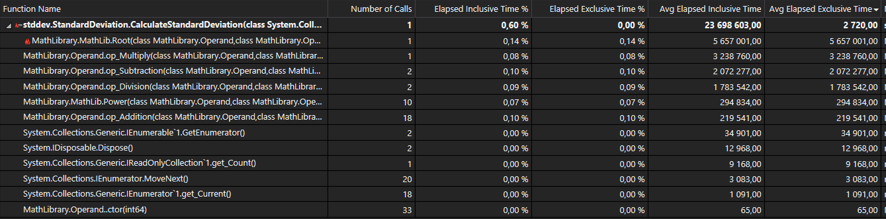
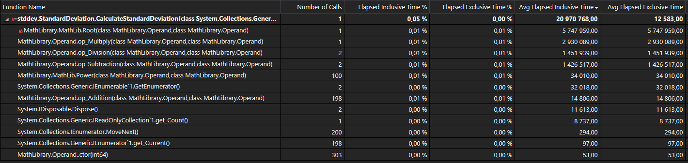
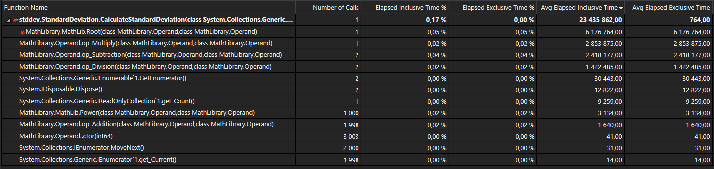

# Stručné shrnutí profilingu

## Úvod

Tento dokument je stručnou zprávou o výsledcích profilingu projektu 2 dp IVS týmu DreamTeamIVS. Jako nástroj pro profiling byla použita vestavěná utilita Microsoft Visual Studia _Performance Profiler_. Jako typ profilingu byl zvolen "Instrumentation" a jako metrika průměrný čas vykonávání funkce ("Avg Elapsed Exclusive Time").

## Výsledky profilingu 

Jak je vidět na obrázcích níže, Funkce, které nejvíce zpomalují celkový běh programu, jsou ``Root()`` a ``op_Multiply()``, tedy druhá mocnina a násobení, a to i přes to, že se tyto funkce nevolají příliš často. Při případné optimalizace výpočtu směrodatné odchylky bychom se tedy soustředili primárně na tyto dvě funkce.

*Výstup rofileru při 10 číslech na vstupu*

*Výstup rofileru při 100 číslech na vstupu*

*Výstup rofileru při 1000 čísel na vstupu*
